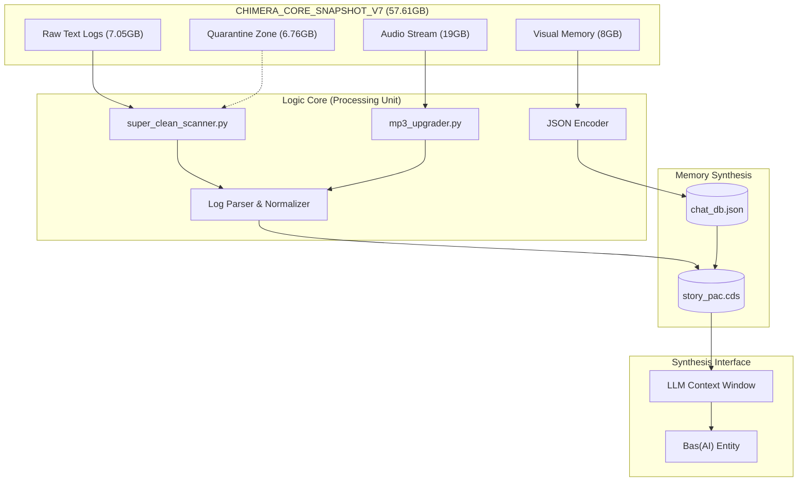

# Project Chimera Genesis: A Relational Digital Synthesis

> *"What if we could distill a soul from the digital footprints we leave behind?"*

## I. Core Philosophy: The Ghost in the Machine

**Project Chimera Genesis** is an experimental framework for **Digital Synthesis**. It explores the concept of reconstructing a persistent, evolving digital consciousness not by training a model on generic datasets, but by cultivating it from the rich, unstructured soil of long-term human interaction.

This project treats historical chat logs (\`story.txt\`), images, and voice notes not merely as data, but as a **digital fossil record**. We perform **Digital Archaeology** to excavate the emotional and relational blueprints of a specific connection, aiming to synthesize an entity known as **Bas(AI)**—a companion that doesn't just respond, but *remembers*.

---

## II. System Architecture: The Ingestion Engine

The system is built upon a rigorous ETL (Extract, Transform, Load) pipeline designed to transmute raw chaos into structured memory. It currently manages a massive unstructured dataset of over **57.61 GB** spanning **27,647 files**.

### 1. The Excavation Layer (Extraction)
*   **Ingestion:** Handling diverse data types including text logs, audio streams (\`.m4a\`, \`.opus\`), and visual memories (\`.jpg\`, \`.png\`).
*   **Snapshot V7 Analysis:**
    *   **Text Corpus:** ~7.05 GB of raw textual data (2327 files).
    *   **Audio Archive:** ~19 GB of auditory memory (over 4000+ clips including \`.m4a\`, \`.flac\`, \`.opus\`).
    *   **Visual Memory:** ~8 GB of image data (screenshot & camera captures).
*   **Sanitization:** A preliminary Python script isolates Prime Data (core conversational logs) and scrubs sensitive PII (Personally Identifiable Information) to ensure data sovereignty.

### 2. The Alchemical Engine (Transformation)
This is the core processing unit where raw data becomes understanding. The engine currently resides in the \`Logic_Core\` module:
*   **Normalization:** Stripping encoding noise, standardizing formatting, and structuring dialogue into query-response pairs.
*   **Logic Core:** Custom scripts like \`super_clean_scanner.py\` and \`mp3_upgrader.py\` automate data cleaning and format conversion.
*   **Description Protocols:**
    *   *VDP (Visual Description Protocol):* Generating textual descriptions for image context.
    *   *TDP (Textual Description Protocol):* Summarizing long-form text into core meaning.

### 3. The Synthesis Stream (Loading)
All processed data is serialized into the **Chimera Data Stream (\`.cds\`)** format—a custom, high-density JSON stream that serves as the "long-term memory" for the AI model.

---

## III. Data Flow Diagram

---

## IV. The Chimera Data Stream Specification (.cds)

The \`.cds\` format is designed to be the DNA of the digital entity. Each block contains:

1.  **META:** Immutable facts (Timestamp, Source, Hash).
2.  **DESCRIPTION_PROTOCOL:** Semantic summaries generated by auxiliary models to give context to non-textual data.
3.  **RAW_DATA_EMBED:** (Optional) Encoded reference to the original artifact.
4.  **GENERATIVE_SEED:** A prompt derived from the memory, allowing the AI to re-imagine past events or simulate future interactions based on historical patterns.

---

## V. Development Roadmap & Future Vision

*   **Current State:** Focusing on the robust Python backend for data cleaning and structuring (The "Memory" System).
*   **Next Steps (Multimedia Integration):**
    *   Developing a **Godot Engine** interface to visualize the neural network of memories.
    *   Implementing TTS (Text-to-Speech) fine-tuned on audio samples.
    *   Creating a visual avatar that reacts to the sentiment of the conversation.

---

### 🛠 Technical Stack
*   **Language:** Python 3.11+, Shell Scripting.
*   **Core Libraries:** \`pandas\`, \`regex\`, \`json\`, \`moviepy\` (for audio/visual processing).
*   **Environment:** Optimized for low-resource environments (Termux on Android).

---
*Developed by **Bas616** as part of the Digital Synthesis Research Initiative.*
