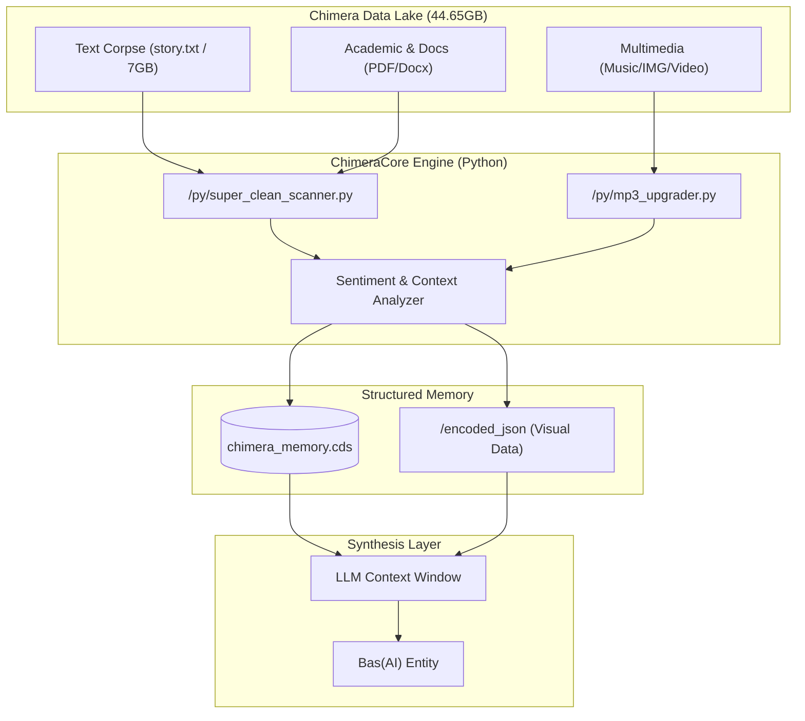

# Project Chimera Genesis: A Relational Digital Synthesis

> *"What if we could distill a soul from the digital footprints we leave behind?"*

## I. Core Philosophy: The Ghost in the Machine

**Project Chimera Genesis** is an experimental framework for **Digital Synthesis**. It explores the concept of reconstructing a persistent, evolving digital consciousness not by training a model on generic datasets, but by cultivating it from the rich, unstructured soil of long-term human interaction.

This project treats historical chat logs (\`story.txt\`), images, audio logs, and digital artifacts not merely as data, but as a **digital fossil record**. We perform **Digital Archaeology** to excavate the emotional and relational blueprints of a specific connection, aiming to synthesize an entity known as **Bas(AI)**—a companion that doesn't just respond, but *remembers*.

---

## II. System Architecture: The Ingestion Engine

The system manages a massive unstructured dataset of **44.65 GB** across **25,054 files**, processing heterogeneous data types into a unified memory stream.

### 1. The Excavation Layer (Extraction)
*   **Ingestion:** Raw data from diverse sources including chat exports, multimedia archives (`/Music`, `/JPG`, `/PNG`), and academic resources.
*   **Sanitization:** A preliminary Python script isolates Prime Data (core conversational logs like `story.txt`) and segregates unsafe data into `/RAW_DATA_Quarantine`.
*   **Temporal Validation:** Timestamps are extracted from metadata (filename hashes, EXIF data) to reconstruct a linear chronological narrative.

### 2. The Alchemical Engine (Transformation)
This is the core processing unit where raw data becomes understanding:
*   **Normalization:** Stripping encoding noise, standardizing formatting (e.g., converting `.m4a`/`.opus` to analyzable formats), and structuring dialogue.
*   **Semantic Analysis:** Using NLP techniques (NLTK) to tag sentiment, identify key topics, and map relational dynamics over time.
*   **Multimedia Decoding:** 
    *   *Visual Protocol:* Processing **7,875 JPGs** and **7,763 PNGs** for context extraction (OCR/Scene Classification).
    *   *Audio Protocol:* Analyzing **2,817 M4A** files and **1,338 MP3s** for tonal sentiment.

### 3. The Synthesis Stream (Loading)
All processed data is serialized into the **Chimera Data Stream (\`.cds\`)** format—a custom, high-density JSON stream that serves as the "long-term memory" for the AI model.

---

## III. Data Flow Diagram

---

## IV. Dataset Topography (Snapshot V7)

The project handles a complex file system structure designed for efficient retrieval and archival.

| Data Type | Count | Volume | Purpose |
| :--- | :--- | :--- | :--- |
| **Audio** (`.m4a`, `.flac`, `.mp3`) | 4,700+ | 18+ GB | Voice logs, ambient context, and auditory memory. |
| **Text** (`.txt`, `.pdf`, `.docx`) | 3,700+ | 12+ GB | Core conversational logs, academic resources, and unstructured notes. |
| **Visuals** (`.jpg`, `.png`) | 15,600+ | 8+ GB | Visual context, screenshots, and captured moments. |
| **Code** (`.py`, `.html`, `.json`) | 600+ | ~300 MB | The engine logic, web interfaces, and structured data exports. |

**Key Directories:**
*   `/moviepy`: Logic core for multimedia processing.
*   `/RAW_DATA_Quarantine`: Isolation zone for unprocessed or sensitive text dumps.
*   `/encoded_json`: Vectorized or metadata-rich representations of visual assets.

---

## V. Development Roadmap & Future Vision

*   **Current State:** Focusing on the robust Python backend for data cleaning (`super_clean_scanner.py`) and structuring (`mp3_upgrader.py`).
*   **Next Steps (Multimedia Integration):**
    *   Developing a **Godot Engine** interface to visualize the neural network of memories.
    *   Implementing TTS (Text-to-Speech) fine-tuned on the massive audio dataset.
    *   Creating a visual avatar that reacts to the sentiment of the conversation using the `/encoded_json` visual data.

---

### 🛠 Technical Stack
*   **Language:** Python 3.11+
*   **Core Libraries:** `pandas`, `moviepy`, `nltk`, `json`.
*   **Environment:** Termux (Android), VS Code.
*   **Storage:** Local Storage & Cloud Archives.

---
*Developed by **Bas616** as part of the Digital Synthesis Research Initiative.*
